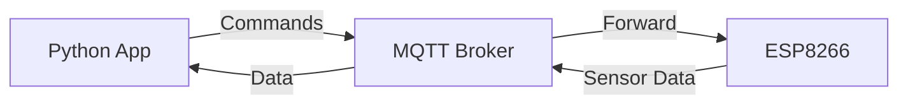
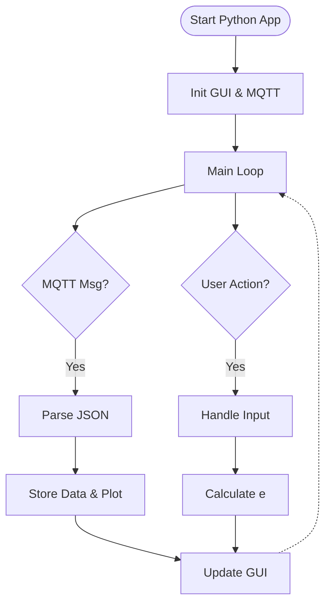

# Koefisien Restitusi IoT Application

Aplikasi IoT untuk mengukur koefisien restitusi bola menggunakan sensor ultrasonik HC-SR04 dengan ESP8266/ESP32 dan interface Python GUI.

<table>
  <tr>
    <td style="text-align:center;">
      <figure>
        
        <figcaption>GUI saat pertama dijalankan</figcaption>
      </figure>
    </td>
    <td style="text-align:center;">
      <figure>
        
        <figcaption>GUI saat mengakuisisi data</figcaption>
      </figure>
    </td>
  </tr>
</table>

## Daftar Isi
1. [Struktur Proyek](#struktur-proyek)
2. [Fitur Utama](#fitur-utama)
3. [Ringkasan Sistem](#ringkasan-sistem)
4. [Alat dan Bahan](#alat-dan-bahan)
5. [Skematik dan Koneksi](#skematik-dan-koneksi)
6. [Arsitektur dan Alur Sistem](#arsitektur-dan-alur-sistem)
7. [Cara Penggunaan](#cara-penggunaan)
8. [Alur Percobaan](#alur-percobaan)
9. [Data Yang Dihasilkan](#data-yang-dihasilkan)
10. [Kontribusi](#kontribusi)

---

## Struktur Proyek

- [espcode](./espcode/) &mdash; Kode ESP8266/ESP32 (C++)
- [python](./python/) &mdash; Aplikasi Python GUI (main.py)
- [data](./data/) &mdash; Data output yang diperoleh seluruh percobaan
- [images](./images/) &mdash; Ilustrasi alat & skematik
- [Modul Praktikum](./Modul-Praktikum-Koefisien-Restitusi.pdf) &mdash; Modul Praktikum Koefisien Restitusi

---
## Fitur Utama

- Deteksi pantulan otomatis (`find_peaks`)
- Hitung koefisien restitusi: `e = √(h₂/h₁)`
- Grafik real-time & tabel data
- Filter noise (Butterworth)
- Kontrol ESP: START/STOP, interval sampling
- Export data: Excel, PNG, TXT

---

## Ringkasan Sistem

1. **Sensor HC-SR04** mendeteksi jarak bola memantul.
2. **ESP8266/ESP32** mengirim data ke MQTT Broker.
3. **Aplikasi Python** menerima & menganalisis data, menghitung koefisien restitusi, dan menampilkan grafik real-time.

<table>
  <tr>
    <td style="text-align:center;">
      <figure>
        
        <figcaption>Ilustrasi alat secara skematik</figcaption>
      </figure>
    </td>
    <td style="text-align:center;">
      <figure>
        
        <figcaption>Foto alat yang telah dirakit</figcaption>
      </figure>
    </td>
  </tr>
</table>

---

## Alat dan Bahan

### Hardware
- ESP8266 (NodeMCU/Wemos D1) / ESP32
- Sensor HC-SR04
- Breadboard & kabel jumper
- Bola (🏓 Bola Tenis Meja, 🎾 Bola Tenis Lapangan, ⚽ Bola Sepak Karet, 🔴 Bola Bekel, 🔵 Bola Plastik)
- Power supply

### Software
- Arduino IDE / PlatformIO
- Python 3.7+ dengan: `tkinter`, `matplotlib`, `pandas`, `scipy`, `paho-mqtt`, `numpy`

---

## Skematik dan Koneksi

<table border="1" style="border-collapse:collapse; text-align:center;">
  <tr>
    <th>HC-SR04</th>
    <th>NodeMCU</th>
    <th rowspan="5" style="padding:10px;">
      
      
Skematik rangkaian HC-SR04 ke NodeMCU

    </th>
  </tr>
  <tr>
    <td>VCC</td>
    <td>3.3V / 5V</td>
  </tr>
  <tr>
    <td>GND</td>
    <td>GND</td>
  </tr>
  <tr>
    <td>Trig</td>
    <td>D1 (GPIO5)</td>
  </tr>
  <tr>
    <td>Echo</td>
    <td>D2 (GPIO4)</td>
  </tr>
</table>

---

## Arsitektur dan Alur Sistem

<table style="border-collapse:collapse; width:100%; text-align:center;">
  <caption style="font-weight:bold; padding:10px;">Koneksi MQTT antara NodeMCU dan Python</caption>
  <tr>
    <td>
      <figure>
        
        <figcaption>Serial Monitor ESP8266 saat mengirim data via MQTT</figcaption>
      </figure>
    </td>
    <td>
      <figure>
        
        <figcaption>Client Python menerima data dari NodeMCU melalui MQTT</figcaption>
      </figure>
    </td>
  </tr>
</table>

- **Komunikasi MQTT**:  
  - `sensor/distance/cmd` (kontrol)
  - `sensor/distance` (data sensor)
- **Broker**: HiveMQ Cloud

Diagram Komunikasi & Flowchart

---

## Cara Penggunaan

1. **Rakit hardware** sesuai skematik.
2. **Upload** kode ke ESP ([espcode](./espcode/)).
3. **Install** library python yang diperlukan ([requirements.txt](requirements.txt)) di terminal dengan _command_ `pip install -r requirements.txt`
4. **Jalankan** aplikasi Python ([python/main.py](./python/main.py)).
5. **Kalibrasi** tinggi sensor.
6. **Mulai eksperimen** & analisis otomatis.
7. **Export** hasil sesuai kebutuhan.

---

## Alur Percobaan

> Setiap Objek dilakukan pengukuran ketinggian oleh alat dengan 20 kali percobaan lalu data yang dihasilkan dihitung standar deviasi setiap objek untuk mengetahui besaran penyimpangan dan besar koefisien restitusi masing-masing objek

| Objek | Jumlah Percobaan | 
| --- | --- |
| 🏓 **Bola Tenis Meja** | 20 |
| 🎾 **Bola Tenis Lapangan** | 20 |
| ⚽ **Bola Sepak Karet** | 20 |
| 🔴 **Bola Bekel** | 20 |
| 🔵 **Bola Plastik** | 20 |

## Data Yang Dihasilkan

| Nama | Jenis File | Direktori | Total File | Keterangan |
| --- | --- |--- | --- | --- |
| Data Ketinggian | Excel (.xlsx) | [Data Percobaan](/data/data-percobaan) | 100 (20x5 objek) | Data ketinggian setiap percobaan |
| Grafik Ketinggian | Gambar (.png) | [Grafik Percobaan](/data/grafik-percobaan) | 100 (20x5 objek) | Grafik dari data ketinggian |
| Analisis Percobaan | Text (.txt) | [Analisis Percobaan](/data/analisis-percobaan) | 100 (20x5 objek) | Analisis dari setiap percobaan |
| Ringkasan Statistik | Excel, Gambar | [Ringkasan Statistik](/data/ringkasan=statistik) | 10 (2x5 objek) | Grafik dan tabel perhitungan standar deviasi dan koefisien restitusi seluruh percobaan pada setiap objek |
| Tabel LaTeX | LaTeX (.tex) | [Tabel LaTeX](/data/tabel-latex) | 105 (20x5 objek + 5 tabel ringkasan)| Konversi data tabel excel ke latex untuk kebutuhan dokumen latex |

---

## Kontribusi

Sistem ini dikembangkan untuk edukasi & penelitian fisika. Kontribusi sangat diharapkan!

---

*Dikembangkan dengan ❤️ untuk fisika & IoT*
