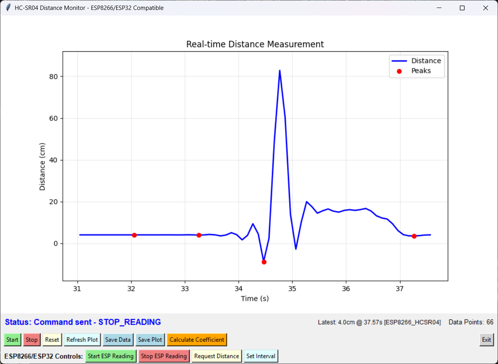

# Koefisien Restitusi IoT Application

Aplikasi IoT untuk mengukur koefisien restitusi bola menggunakan sensor ultrasonik HC-SR04 dengan ESP8266/ESP32 dan interface Python GUI.



## Deskripsi

Sistem ini mengukur koefisien restitusi (coefficient of restitution) dengan cara:
1. Mendeteksi jarak bola yang memantul menggunakan sensor HC-SR04
2. Mengirim data secara real-time melalui MQTT
3. Menganalisis data bouncing untuk menghitung koefisien restitusi
4. Menampilkan grafik dan hasil perhitungan di aplikasi Python

## Alat dan Bahan

### Hardware
- **ESP8266** (NodeMCU/Wemos D1) atau **ESP32**
- **Sensor HC-SR04** (ultrasonik distance sensor)
- **Breadboard** dan **kabel jumper**
- **Bola** untuk testing (ping pong ball, rubber ball, dll)
- **Power supply** untuk ESP (USB cable)

### Software
- **Arduino IDE** atau **PlatformIO** untuk programming ESP
- **Python 3.7+** dengan libraries:
  - `tkinter` (GUI)
  - `matplotlib` (plotting)
  - `pandas` (data processing)
  - `scipy` (signal processing)
  - `paho-mqtt` (MQTT client)
  - `numpy` (numerical computing)
  - `json` (data parsing)

### Koneksi Hardware

#### ESP8266 (NodeMCU)
```
HC-SR04    NodeMCU
VCC   →    3.3V/5V
GND   →    GND
Trig  →    D1 (GPIO5)
Echo  →    D2 (GPIO4)
```

#### ESP32
```
HC-SR04    ESP32
VCC   →    3.3V/5V
GND   →    GND
Trig  →    GPIO14
Echo  →    GPIO27
```

## Struktur Kode

```
KoefisienRestitusiIOTApp/
├── src/
│   └── main.cpp              # Kode ESP8266/ESP32
├── python/
│   └── main.py              # Aplikasi Python GUI
└── readme.md                # Dokumentasi ini
```

### File: `src/main.cpp`

**Fungsi Utama:**
- **WiFi Connection**: Menghubungkan ESP ke WiFi
- **MQTT Client**: Komunikasi dengan broker MQTT (broker.hivemq.com)
- **HC-SR04 Reading**: Membaca jarak dari sensor ultrasonik
- **JSON Publishing**: Mengirim data dalam format JSON
- **Command Processing**: Menerima perintah dari aplikasi Python

**Topik MQTT:**
- `sensor/distance` - untuk publish data sensor
- `sensor/distance/cmd` - untuk menerima command dari Python

**Commands yang didukung:**
- `START_READING` - Mulai pembacaan sensor
- `STOP_READING` - Berhenti pembacaan sensor  
- `READ_DISTANCE` - Baca jarak sekali
- `INTERVAL:xxx` - Set interval pembacaan (ms)

### File: `python/main.py`

**Komponen Utama:**
- **MQTT Client**: Menerima data dari ESP via MQTT
- **GUI Interface**: Tkinter-based interface dengan kontrol
- **Real-time Plotting**: Matplotlib untuk grafik real-time
- **Signal Processing**: Filter dan deteksi bounce menggunakan scipy
- **Data Export**: Save ke Excel/CSV dan plot ke PNG/PDF

**Fitur GUI:**
- Start/Stop data collection
- Real-time distance plotting
- Bounce detection dengan peak marking
- Koefisien restitusi calculation
- Data export (Excel, PNG)
- ESP remote control

## Cara Kerja Sistem

### 1. Setup Hardware
1. Hubungkan HC-SR04 ke ESP sesuai diagram koneksi
2. Upload kode `main.cpp` ke ESP menggunakan Arduino IDE
3. Pastikan ESP terhubung ke WiFi yang sama dengan komputer

### 2. Setup Software
```bash
# Install Python dependencies
pip install tkinter matplotlib pandas scipy paho-mqtt numpy
```

### 3. Menjalankan Aplikasi
1. **Jalankan ESP**: Power on ESP, tunggu hingga connect ke WiFi
2. **Jalankan Python**: 
   ```bash
   cd python
   python main.py
   ```
3. **Monitor Connection**: Pastikan status "Connected to MQTT" di aplikasi

### 4. Pengukuran Koefisien Restitusi

#### Langkah Pengukuran:
1. **Posisikan Setup**: 
   - Letakkan sensor HC-SR04 menghadap ke area bouncing
   - Pastikan bola akan memantul di area deteksi sensor (2-400 cm)

2. **Start Collection**:
   - Klik tombol "Start" di aplikasi Python
   - ESP akan mulai mengirim data real-time

3. **Drop Ball**:
   - Jatuhkan bola dari ketinggian tertentu
   - Biarkan bola memantul beberapa kali
   - Grafik akan menampilkan pola bouncing secara real-time

4. **Analisis**:
   - Setelah cukup data, klik "Calculate Coefficient"
   - Aplikasi akan mendeteksi bounce peaks
   - Menghitung koefisien restitusi: e = √(h₂/h₁)

#### Formula Koefisien Restitusi:
```
e = √(h_after / h_before)
```
Dimana:
- `e` = koefisien restitusi (0-1)
- `h_after` = tinggi bounce setelah
- `h_before` = tinggi bounce sebelum

### 5. Kontrol Remote ESP
- **Start ESP Reading**: Mulai sensor reading di ESP
- **Stop ESP Reading**: Stop sensor reading di ESP  
- **Request Distance**: Minta satu kali pembacaan
- **Set Interval**: Ubah interval pembacaan (50-5000ms)

## Fitur Signal Processing

### Low-pass Filter
- **Cutoff**: 5 Hz
- **Order**: 4th order Butterworth
- **Purpose**: Mengurangi noise pada data jarak

### Bounce Detection
- **Method**: Peak detection pada sinyal terbalik
- **Parameters**: 
  - Minimum height: 5 cm
  - Minimum distance: 10 samples
- **Output**: Koordinat bounce points

### Coefficient Calculation
- **Input**: Sequence of bounce heights
- **Method**: Rasio akar kuadrat tinggi bounce berturut-turut
- **Output**: Individual dan average coefficient

## Troubleshooting

### ESP Connection Issues
```cpp
// Check Serial Monitor untuk:
- WiFi connection status
- MQTT connection status  
- Published messages
```

### Python MQTT Issues
```python
# Check console output untuk:
- "Connected to MQTT Broker!"
- "Subscribed to: sensor/distance"
- Received JSON messages
```

### Data Quality Issues
- **Noisy Data**: Increase low-pass filter cutoff
- **No Bounces Detected**: Adjust detection parameters
- **Invalid Readings**: Check sensor positioning dan range

## Tutorial References

[How to Publish DHT11 Sensor Data from NodeMCU to Mosquitto MQTT Broker over LAN | NodeMCU | MQTT |](https://www.youtube.com/watch?v=5rHWeV0dwxo)

[Netsh Port Forwarding from LAN IP(192.168.xx.xx)-Port(1883) to Local IP(127.0.0.1)-Port(1883) for Mosquitto MQTT Broker](https://fusion-automate.blogspot.com/2023/05/netsh-port-forwarding-from-lan.html)

## License

Open source - feel free to modify and distribute.
