# Koefisien Restitusi IoT Application

Aplikasi IoT untuk mengukur koefisien restitusi bola menggunakan sensor ultrasonik HC-SR04 dengan ESP8266/ESP32 dan interface Python GUI.

Sistem ini mengukur koefisien restitusi (coefficient of restitution) dengan cara:
1. Mendeteksi jarak bola yang memantul menggunakan sensor HC-SR04
2. Mengirim data secara real-time melalui MQTT
3. Menganalisis data bouncing untuk menghitung koefisien restitusi
4. Menampilkan grafik dan hasil perhitungan di aplikasi Python


## Alat dan Bahan

### Hardware
- **ESP8266** (NodeMCU/Wemos D1) atau **ESP32**
- **Sensor HC-SR04** (ultrasonik distance sensor)
- **Breadboard** dan **kabel jumper**
- **Bola** untuk testing (ping pong ball, rubber ball, dll)
- **Power supply** untuk ESP (USB cable)

### Software
- **Arduino IDE** atau **PlatformIO** untuk programming ESP
- **Python 3.7+** dengan libraries:
  - `tkinter` (GUI)
  - `matplotlib` (plotting)
  - `pandas` (data processing)
  - `scipy` (signal processing)
  - `paho-mqtt` (MQTT client)
  - `numpy` (numerical computing)
  - `json` (data parsing)

### Koneksi Hardware

#### Skematik Rangkaian

<div style="display:flex; justify-content:center;">  
  
</div>


#### ESP8266 (NodeMCU)
|HC-SR04 | NodeMCU |
|---|---|
|VCC   | 3.3V/5V |
| GND   |    GND |
|Trig  |    D1 (GPIO5) |
| Echo  |    D2 (GPIO4) |

## Struktur Kode

```
KoefisienRestitusiIOTApp/
├── espcode/
│   └── espcode.h              # Kode ESP8266/ESP32
├── python/
│   └── main.py              # Aplikasi Python GUI
└── readme.md                # Dokumentasi ini
```


## Arsitektur Sistem
<details>
  <summary>
    Detail
  </summary>

### Diagram Komunikasi MQTT

```mermaid
graph LR
    A[Python App<br/>🖥️ GUI & Analysis] 
    B[MQTT Broker<br/>☁️ HiveMQ Cloud]
    C[ESP8266<br/>📡 HC-SR04 Sensor]

    A -->|Commands| B
    B -->|Forward| C  
    C -->|Sensor Data| B
    B -->|Data| A

    %% Styling
    classDef python fill:#e1f5fe,stroke:#01579b,stroke-width:2px
    classDef mqtt fill:#fff3e0,stroke:#e65100,stroke-width:2px
    classDef esp fill:#e8f5e8,stroke:#2e7d32,stroke-width:2px

    class A python
    class B mqtt
    class C esp
```



### Alur Komunikasi

1. **📤 Python → Broker**: Kirim perintah START/STOP
2. **🔄 Broker → ESP8266**: Teruskan perintah ke sensor
3. **📡 ESP8266 → Broker**: Kirim data jarak JSON
4. **📥 Broker → Python**: Terima data untuk analisis

**Topics MQTT:**
- `sensor/distance/cmd` - Perintah kontrol
- `sensor/distance` - Data sensor

## Flowchart Program

### Program Python

```mermaid
flowchart TD
    Start([🚀 Start Python App]) --> Init[🔧 Initialize GUI<br/>Setup MQTT<br/>Connect Broker]
    Init --> Loop[🔄 Main Event Loop]
    
    Loop --> MQTTCheck{📨 MQTT<br/>Message?}
    Loop --> UserCheck{👤 User<br/>Action?}
    
    MQTTCheck -->|Yes| Parse[📋 Parse JSON<br/>Validate Data]
    Parse --> Collecting{📊 Collecting<br/>Data?}
    Collecting -->|Yes| Store[💾 Store Data<br/>Update Plot]
    
    UserCheck -->|Yes| Handle[🎛️ Handle User<br/>Input]
    Handle --> Analyze{🧮 Calculate<br/>Coefficient?}
    Analyze -->|Yes| Calc[🔍 Detect Bounces<br/>Calculate e]
    
    Store --> Update[🖥️ Update GUI<br/>Display Results]
    Calc --> Update
    
    MQTTCheck -->|No| Update
    UserCheck -->|No| Update
    Collecting -->|No| Update
    Analyze -->|No| Update
    
    Update -.->|Loop Back| Loop
    Update --> End([🛑 Exit Application])

    %% Styling
    classDef startEnd fill:#c8e6c9,stroke:#2e7d32,stroke-width:3px
    classDef process fill:#bbdefb,stroke:#1976d2,stroke-width:2px
    classDef decision fill:#fff9c4,stroke:#f57f17,stroke-width:2px
    classDef update fill:#f8bbd9,stroke:#c2185b,stroke-width:2px

    class Start,End startEnd
    class Init,Parse,Store,Handle,Calc process
    class MQTTCheck,UserCheck,Collecting,Analyze decision
    class Update update
```



### Program ESP8266

```mermaid
flowchart TD
    Start([🚀 Start ESP8266]) --> InitHW[🔧 Initialize<br/>Pins & Serial]
    InitHW --> WiFi[📶 Connect WiFi]
    WiFi --> MQTT[📡 Connect MQTT<br/>Subscribe Topics]
    MQTT --> MainLoop[🔄 Main Loop]
    
    MainLoop --> CmdCheck{📨 Command<br/>Received?}
    MainLoop --> ReadCheck{📊 Reading Mode &<br/>Interval?}
    
    CmdCheck -->|Yes| ParseCmd[📋 Parse Command]
    ParseCmd --> CmdType{🎛️ Command Type?}
    
    CmdType -->|START| StartRead[▶️ Set Reading TRUE]
    CmdType -->|STOP| StopRead[⏹️ Set Reading FALSE]
    
    ReadCheck -->|Yes| Sensor[📏 Read HC-SR04]
    Sensor --> Validate[✅ Validate Data]
    Validate --> JSON[📋 Create JSON]
    JSON --> Publish[📤 Publish MQTT]
    
    StartRead -.->|Loop Back| MainLoop
    StopRead -.->|Loop Back| MainLoop
    Publish -.->|Loop Back| MainLoop
    
    CmdCheck -->|No| MainLoop
    ReadCheck -->|No| MainLoop

    %% Styling
    classDef startEnd fill:#c8e6c9,stroke:#2e7d32,stroke-width:3px
    classDef process fill:#bbdefb,stroke:#1976d2,stroke-width:2px
    classDef decision fill:#fff9c4,stroke:#f57f17,stroke-width:2px
    classDef action fill:#ffcdd2,stroke:#d32f2f,stroke-width:2px

    class Start startEnd
    class InitHW,WiFi,MQTT,ParseCmd,Sensor,Validate,JSON,Publish process
    class CmdCheck,ReadCheck,CmdType decision
    class StartRead,StopRead action
```


</details>

## Fitur Utama

### 🔬 Analisis Real-time
- Deteksi pantulan otomatis menggunakan algoritma `find_peaks`
- Perhitungan koefisien restitusi: `e = √(h₂/h₁)`
- Analisis statistik komprehensif
- Klasifikasi material berdasarkan elastisitas

### 📊 Visualisasi Data
- Grafik real-time tinggi bola vs waktu
- Tabel data sensor 50 terakhir
- Penandaan puncak pantulan otomatis
- Filter noise dengan low-pass Butterworth

### 🎛️ Kontrol ESP8266
- Perintah START/STOP pembacaan
- Konfigurasi interval sampling (50-5000ms)
- Monitor status koneksi WiFi dan MQTT
- Validasi data sensor (2-400cm)

### 💾 Export Data
- Format Excel (.xlsx) untuk analisis statistik
- Format PNG untuk dokumentasi grafik
- File analisis text lengkap dengan hasil perhitungan
- Metadata percobaan dan konfigurasi

## Spesifikasi Teknis

| Parameter | Nilai |
|-----------|-------|
| **Sensor Range** | 2-400 cm |
| **Sampling Rate** | 50-5000 ms (konfigurasi) |
| **Formula Analisis** | e = √(h₂/h₁) |
| **MQTT Topics** | sensor/distance, sensor/distance/cmd |
| **Protokol Komunikasi** | MQTT over WiFi |
| **Broker Cloud** | HiveMQ (broker.hivemq.com) |

## Jenis Bola yang Didukung

- 🏓 **Bola Tenis Meja** - Elastisitas tinggi
- 🎾 **Bola Tenis Lapangan** - Elastisitas sedang-tinggi  
- ⚽ **Bola Sepak Karet** - Elastisitas sedang
- 🔴 **Bola Bekel** - Elastisitas tinggi
- 🔵 **Bola Plastik** - Elastisitas rendah-sedang

## Persyaratan Sistem

### Hardware
- ESP8266 (NodeMCU/Wemos D1 Mini)
- Sensor HC-SR04
- Breadboard dan kabel jumper
- Power supply 5V

### Software  
- Python 3.8+
- Libraries: tkinter, matplotlib, pandas, scipy, paho-mqtt, numpy
- Arduino IDE dengan library WiFi dan PubSubClient
- Koneksi internet untuk MQTT broker

## Cara Penggunaan

1. **Setup Hardware**: Hubungkan HC-SR04 ke ESP8266
2. **Upload Code**: Flash program ESP8266 dengan konfigurasi WiFi
3. **Run Python**: Jalankan aplikasi monitoring Python
4. **Kalibrasi**: Atur tinggi sensor dari lantai
5. **Mulai Percobaan**: Klik "Mulai Pengumpulan" dan lepas bola
6. **Analisis**: Sistem otomatis menghitung koefisien restitusi
7. **Export**: Simpan hasil dalam format Excel/PNG/Text

## Kontribusi

Sistem ini dikembangkan untuk penelitian dan edukasi fisika. Kontribusi dan pengembangan lebih lanjut sangat diharapkan untuk meningkatkan akurasi dan fitur analisis.

---

*Dikembangkan dengan ❤️ untuk fisika dan IoT*
