# Koefisien Restitusi IoT Application

Aplikasi IoT untuk mengukur koefisien restitusi bola menggunakan sensor ultrasonik HC-SR04 dengan ESP8266/ESP32 dan interface Python GUI.


## Deskripsi

Sistem ini mengukur koefisien restitusi (coefficient of restitution) dengan cara:
1. Mendeteksi jarak bola yang memantul menggunakan sensor HC-SR04
2. Mengirim data secara real-time melalui MQTT
3. Menganalisis data bouncing untuk menghitung koefisien restitusi
4. Menampilkan grafik dan hasil perhitungan di aplikasi Python

## Alat dan Bahan

### Hardware
- **ESP8266** (NodeMCU/Wemos D1) atau **ESP32**
- **Sensor HC-SR04** (ultrasonik distance sensor)
- **Breadboard** dan **kabel jumper**
- **Bola** untuk testing (ping pong ball, rubber ball, dll)
- **Power supply** untuk ESP (USB cable)

### Software
- **Arduino IDE** atau **PlatformIO** untuk programming ESP
- **Python 3.7+** dengan libraries:
  - `tkinter` (GUI)
  - `matplotlib` (plotting)
  - `pandas` (data processing)
  - `scipy` (signal processing)
  - `paho-mqtt` (MQTT client)
  - `numpy` (numerical computing)
  - `json` (data parsing)

### Koneksi Hardware

#### ESP8266 (NodeMCU)
```
HC-SR04    NodeMCU
VCC   →    3.3V/5V
GND   →    GND
Trig  →    D1 (GPIO5)
Echo  →    D2 (GPIO4)
```

#### ESP32
```
HC-SR04    ESP32
VCC   →    3.3V/5V
GND   →    GND
Trig  →    GPIO14
Echo  →    GPIO27
```

## Struktur Kode

```
KoefisienRestitusiIOTApp/
├── src/
│   └── main.cpp              # Kode ESP8266/ESP32
├── python/
│   └── main.py              # Aplikasi Python GUI
└── readme.md                # Dokumentasi ini
```

### File: `src/main.cpp`

**Fungsi Utama:**
- **WiFi Connection**: Menghubungkan ESP ke WiFi
- **MQTT Client**: Komunikasi dengan broker MQTT (broker.hivemq.com)
- **HC-SR04 Reading**: Membaca jarak dari sensor ultrasonik
- **JSON Publishing**: Mengirim data dalam format JSON
- **Command Processing**: Menerima perintah dari aplikasi Python

**Topik MQTT:**
- `sensor/distance` - untuk publish data sensor
- `sensor/distance/cmd` - untuk menerima command dari Python

**Commands yang didukung:**
- `START_READING` - Mulai pembacaan sensor
- `STOP_READING` - Berhenti pembacaan sensor  
- `READ_DISTANCE` - Baca jarak sekali
- `INTERVAL:xxx` - Set interval pembacaan (ms)

### File: `python/main.py`

**Komponen Utama:**
- **MQTT Client**: Menerima data dari ESP via MQTT
- **GUI Interface**: Tkinter-based interface dengan kontrol
- **Real-time Plotting**: Matplotlib untuk grafik real-time
- **Signal Processing**: Filter dan deteksi bounce menggunakan scipy
- **Data Export**: Save ke Excel/CSV dan plot ke PNG/PDF

**Fitur GUI:**
- Start/Stop data collection
- Real-time distance plotting
- Bounce detection dengan peak marking
- Koefisien restitusi calculation
- Data export (Excel, PNG)
- ESP remote control

#### Struktur dan Alur Kode Python

##### 1. **Global Variables dan Konfigurasi**
```python
# Data storage
time_data = []          # Menyimpan timestamp
distance_data = []      # Menyimpan tinggi bola (sensor_height - raw_distance)
collecting = False      # Status pengumpulan data
sensor_height = 35      # Tinggi sensor dari lantai (cm)

# MQTT Configuration
MQTT_BROKER = "broker.hivemq.com"
MQTT_TOPIC = "sensor/distance"
```

##### 2. **Fungsi Signal Processing**

**`lowpass_filter(data, cutoff=5, fs=20, order=4)`**
- **Tujuan**: Menghaluskan data untuk mengurangi noise
- **Input**: Array data mentah, parameter filter
- **Output**: Data yang sudah difilter
- **Algoritma**: Butterworth low-pass filter menggunakan scipy
```python
# Menerapkan filter hanya jika data cukup (>20 points)
# Menggunakan filtfilt untuk zero-phase filtering
```

**`detect_bounces(distance_data, time_data, min_height=5, min_distance=10)`**
- **Tujuan**: Mendeteksi titik pantulan bola
- **Input**: Data tinggi bola dan waktu
- **Output**: Koordinat bounce points (waktu, tinggi)
- **Algoritma**: Peak detection pada sinyal terbalik
```python
# Membalik sinyal (negatif) untuk deteksi minimum sebagai peak
# Menggunakan scipy.signal.find_peaks dengan parameter threshold
```

**`calculate_restitution_coefficient()`**
- **Tujuan**: Menghitung koefisien restitusi dari bounce data
- **Formula**: e = √(h_after / h_before)
- **Alur**:
  1. Filter data menggunakan lowpass_filter()
  2. Deteksi bounce menggunakan detect_bounces()
  3. Hitung koefisien untuk setiap pasangan bounce berturut-turut
  4. Tampilkan hasil dalam dialog box

##### 3. **Fungsi MQTT Communication**

**`on_connect(client, userdata, flags, reason_code, properties=None)`**
- **Trigger**: Saat terkoneksi ke MQTT broker
- **Aksi**: Subscribe ke topik sensor data saja (tidak ke command topic untuk avoid loop)
- **Update GUI**: Status label menjadi "Connected to MQTT"

**`on_disconnect(client, userdata, flags, reason_code, properties=None)`**
- **Trigger**: Saat terputus dari MQTT broker
- **Aksi**: Update status label menjadi "MQTT Disconnected"

**`on_message(client, userdata, msg)`**
- **Trigger**: Saat menerima pesan MQTT dari ESP
- **Alur**:
  1. **Filter Command Echo**: Abaikan pesan dari command topic
  2. **Check Collection Status**: Hanya proses jika `collecting = True`
  3. **Parse Data**: Coba JSON dulu, fallback ke text format
  4. **Data Validation**: Validasi range distance (0-400cm)
  5. **Convert to Ball Height**: `ball_height = sensor_height - raw_distance`
  6. **Validate Ball Height**: Harus positif (>0)
  7. **Timestamp Handling**: Gunakan ESP timestamp atau generate lokal
  8. **Store Data**: Simpan ke arrays global
  9. **Update GUI**: Refresh labels dan trigger plot update

**`send_mqtt_command(command)`**
- **Tujuan**: Kirim perintah ke ESP via MQTT
- **Target Topic**: `sensor/distance/cmd`
- **Commands**: START_READING, STOP_READING, READ_DISTANCE, INTERVAL:xxx

##### 4. **Fungsi Data Collection Control**

**`start_collection()`**
- **Alur**:
  1. Set `collecting = True`
  2. Reset start_time untuk timestamp relatif
  3. Kirim command "START_READING" ke ESP
  4. Update status GUI menjadi "Collecting"

**`stop_collection()`**
- **Alur**:
  1. Set `collecting = False`
  2. Kirim command "STOP_READING" ke ESP
  3. Update status GUI menjadi "Stopped"

**`reset_data()`**
- **Alur**:
  1. Clear semua arrays data
  2. Reset start_time
  3. Update counters dan labels
  4. Refresh plot kosong

##### 5. **Fungsi Visualisasi**

**`update_plot()`**
- **Trigger**: Dipanggil oleh periodic_update() atau manual refresh
- **Alur**:
  1. **Clear Plot**: Bersihkan axes matplotlib
  2. **Check Data**: Jika kosong, tampilkan plot kosong
  3. **Apply Filter**: Gunakan lowpass_filter jika data >20 points
  4. **Plot Main Line**: Garis biru untuk tinggi bola
  5. **Detect & Plot Bounces**: Titik merah untuk bounce peaks (jika >30 points)
  6. **Set Labels & Legends**: Update title dengan sensor height
  7. **Auto-scale Axes**: Atur batas X dan Y dengan margin
  8. **Draw Canvas**: Refresh tampilan

**`periodic_update()`**
- **Trigger**: Dipanggil setiap 50-200ms oleh Tkinter timer
- **Alur**:
  1. Check flag `update_needed`
  2. Panggil update_plot() jika perlu
  3. Update GUI idle tasks
  4. Schedule next update dengan interval adaptif

##### 6. **Fungsi Configuration**

**`set_sensor_height()`**
- **Tujuan**: Set tinggi sensor dari lantai
- **Alur**:
  1. Tampilkan dialog input (10-200cm)
  2. Update global variable `sensor_height`
  3. Trigger plot refresh untuk update title
  4. Update status label

**`set_interval()`**
- **Tujuan**: Set interval pembacaan sensor ESP
- **Alur**:
  1. Dialog input interval (50-5000ms)
  2. Kirim command "INTERVAL:xxx" ke ESP

##### 7. **Fungsi Data Export**

**`save_excel()`**
- **Data Columns**:
  - Time (s): Timestamp relatif
  - Ball Height (cm): Tinggi bola dari lantai
  - Sensor Height (cm): Tinggi sensor (konstanta)
- **Format**: Excel (.xlsx) menggunakan pandas

**`save_png()`**
- **Output**: Plot saat ini dalam format PNG
- **Quality**: Default matplotlib DPI

##### 8. **Fungsi GUI Setup**

**`setup_gui()`**
- **Alur**:
  1. **Create Main Window**: Tkinter root dengan title
  2. **Setup Matplotlib**: Figure, axes, dan canvas
  3. **Create Status Frame**: Labels untuk status, data count, latest data
  4. **Create Config Frame**: Tombol sensor height setting
  5. **Create Button Frame**: Kontrol utama (Start/Stop/Reset/etc.)
  6. **Create ESP Frame**: Kontrol remote ESP
  7. **Pack All Frames**: Arrange layout

##### 9. **Main Application Flow**

**`main()`**
- **Startup Sequence**:
  1. Print aplikasi info dan konfigurasi
  2. Panggil setup_gui() - buat interface
  3. Panggil setup_mqtt() - koneksi ke broker
  4. Start periodic_update() timer (100ms delay)
  5. Print usage instructions
  6. Start tkinter mainloop() - event handling

#### Alur Data Flow Lengkap

```
ESP Sensor Reading → MQTT Publish → Python MQTT Client → 
Data Validation → Height Conversion → Store Arrays → 
Update GUI → Plot Refresh → User Analysis → Export Results
```

**Real-time Processing:**
1. ESP baca HC-SR04 setiap 100ms (default)
2. ESP kirim JSON via MQTT
3. Python terima di on_message()
4. Konversi raw distance ke ball height
5. Store ke time_data[] dan distance_data[]
6. Trigger update_needed flag
7. periodic_update() deteksi flag
8. update_plot() refresh visualization
9. User dapat lihat bounce pattern real-time

**User Interaction Flow:**
1. Set sensor height sesuai setup fisik
2. Klik "Start" → Python kirim START_READING → ESP mulai
3. Drop bola di area sensor
4. Monitor real-time plot
5. Klik "Stop" → Python kirim STOP_READING → ESP berhenti
6. Klik "Calculate Coefficient" → Analisis bounce pattern
7. Export data/plot jika diperlukan

## Troubleshooting

### ESP Connection Issues
```cpp
// Check Serial Monitor untuk:
- WiFi connection status
- MQTT connection status  
- Published messages
```

### Python MQTT Issues
```python
# Check console output untuk:
- "Connected to MQTT Broker!"
- "Subscribed to: sensor/distance"
- Received JSON messages
```

### Data Quality Issues
- **Noisy Data**: Increase low-pass filter cutoff
- **No Bounces Detected**: Adjust detection parameters
- **Invalid Readings**: Check sensor positioning dan range

## Tutorial References

[How to Publish DHT11 Sensor Data from NodeMCU to Mosquitto MQTT Broker over LAN | NodeMCU | MQTT |](https://www.youtube.com/watch?v=5rHWeV0dwxo)

[Netsh Port Forwarding from LAN IP(192.168.xx.xx)-Port(1883) to Local IP(127.0.0.1)-Port(1883) for Mosquitto MQTT Broker](https://fusion-automate.blogspot.com/2023/05/netsh-port-forwarding-from-lan.html)

## License

Open source - feel free to modify and distribute.

# Sistem Monitor Koefisien Restitusi Bola IoT

Sistem IoT untuk mengukur dan menganalisis koefisien restitusi bola menggunakan ESP8266 dan sensor HC-SR04 dengan aplikasi Python real-time.

## Arsitektur Sistem

### Diagram Komunikasi MQTT

```mermaid
graph LR
    A[Python App<br/>🖥️ GUI & Analysis] 
    B[MQTT Broker<br/>☁️ HiveMQ Cloud]
    C[ESP8266<br/>📡 HC-SR04 Sensor]

    A -->|Commands| B
    B -->|Forward| C  
    C -->|Sensor Data| B
    B -->|Data| A

    %% Styling
    classDef python fill:#e1f5fe,stroke:#01579b,stroke-width:2px
    classDef mqtt fill:#fff3e0,stroke:#e65100,stroke-width:2px
    classDef esp fill:#e8f5e8,stroke:#2e7d32,stroke-width:2px

    class A python
    class B mqtt
    class C esp
```



### Alur Komunikasi

1. **📤 Python → Broker**: Kirim perintah START/STOP
2. **🔄 Broker → ESP8266**: Teruskan perintah ke sensor
3. **📡 ESP8266 → Broker**: Kirim data jarak JSON
4. **📥 Broker → Python**: Terima data untuk analisis

**Topics MQTT:**
- `sensor/distance/cmd` - Perintah kontrol
- `sensor/distance` - Data sensor

## Flowchart Program

### Program Python


### Program ESP8266


## Fitur Utama

### 🔬 Analisis Real-time
- Deteksi pantulan otomatis menggunakan algoritma `find_peaks`
- Perhitungan koefisien restitusi: `e = √(h₂/h₁)`
- Analisis statistik komprehensif
- Klasifikasi material berdasarkan elastisitas

### 📊 Visualisasi Data
- Grafik real-time tinggi bola vs waktu
- Tabel data sensor 50 terakhir
- Penandaan puncak pantulan otomatis
- Filter noise dengan low-pass Butterworth

### 🎛️ Kontrol ESP8266
- Perintah START/STOP pembacaan
- Konfigurasi interval sampling (50-5000ms)
- Monitor status koneksi WiFi dan MQTT
- Validasi data sensor (2-400cm)

### 💾 Export Data
- Format Excel (.xlsx) untuk analisis statistik
- Format PNG untuk dokumentasi grafik
- File analisis text lengkap dengan hasil perhitungan
- Metadata percobaan dan konfigurasi

## Spesifikasi Teknis

| Parameter | Nilai |
|-----------|-------|
| **Sensor Range** | 2-400 cm |
| **Sampling Rate** | 50-5000 ms (konfigurasi) |
| **Formula Analisis** | e = √(h₂/h₁) |
| **MQTT Topics** | sensor/distance, sensor/distance/cmd |
| **Protokol Komunikasi** | MQTT over WiFi |
| **Broker Cloud** | HiveMQ (broker.hivemq.com) |

## Jenis Bola yang Didukung

- 🏓 **Bola Tenis Meja** - Elastisitas tinggi
- 🎾 **Bola Tenis Lapangan** - Elastisitas sedang-tinggi  
- ⚽ **Bola Sepak Karet** - Elastisitas sedang
- 🔴 **Bola Bekel** - Elastisitas tinggi
- 🔵 **Bola Plastik** - Elastisitas rendah-sedang

## Persyaratan Sistem

### Hardware
- ESP8266 (NodeMCU/Wemos D1 Mini)
- Sensor HC-SR04
- Breadboard dan kabel jumper
- Power supply 5V

### Software  
- Python 3.8+
- Libraries: tkinter, matplotlib, pandas, scipy, paho-mqtt, numpy
- Arduino IDE dengan library WiFi dan PubSubClient
- Koneksi internet untuk MQTT broker

## Cara Penggunaan

1. **Setup Hardware**: Hubungkan HC-SR04 ke ESP8266
2. **Upload Code**: Flash program ESP8266 dengan konfigurasi WiFi
3. **Run Python**: Jalankan aplikasi monitoring Python
4. **Kalibrasi**: Atur tinggi sensor dari lantai
5. **Mulai Percobaan**: Klik "Mulai Pengumpulan" dan lepas bola
6. **Analisis**: Sistem otomatis menghitung koefisien restitusi
7. **Export**: Simpan hasil dalam format Excel/PNG/Text

## Kontribusi

Sistem ini dikembangkan untuk penelitian dan edukasi fisika. Kontribusi dan pengembangan lebih lanjut sangat diharapkan untuk meningkatkan akurasi dan fitur analisis.

---

*Dikembangkan dengan ❤️ untuk pendidikan fisika dan IoT*
