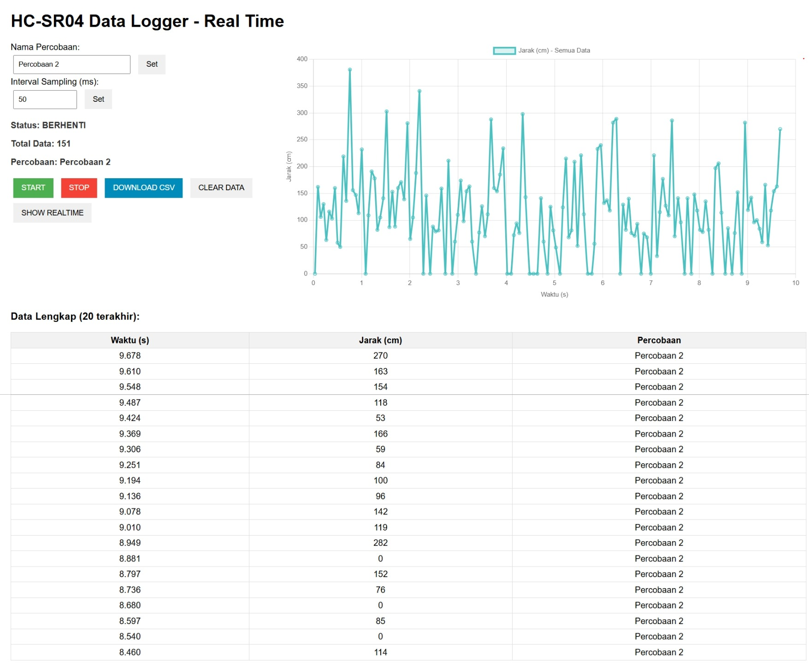

# KoefisienRestitusiIOTApp



Aplikasi IoT untuk mengukur koefisien restitusi menggunakan sensor HC-SR04 dan ESP8266/ESP32 dengan komunikasi MQTT dan Web Server real-time.

## ✨ Fitur Utama
- 📊 **Real-time Data Logging** - Monitoring data sensor secara langsung
- 🌐 **Web Interface** - Antarmuka web dengan grafik dan tabel interaktif
- 📱 **Responsive Design** - Dapat diakses dari PC, tablet, atau smartphone
- 📈 **Live Chart** - Grafik real-time dengan Chart.js
- 💾 **Export CSV** - Download data dengan nama file sesuai percobaan
- 🔧 **Configurable Sampling** - Atur interval sampling dari 10ms-1000ms
- 🔄 **MQTT Support** - Komunikasi IoT dengan protokol MQTT
- ⚡ **Non-blocking Operation** - Operasi asynchronous tanpa delay
- 🔍 **Dual View Mode** - Toggle antara tampilan real-time dan semua data
- 📊 **Interactive Chart** - Visualisasi data dengan Chart.js yang responsif

## 🖼️ Tampilan Interface

Interface web menampilkan:
- **Panel Kontrol** - Pengaturan nama percobaan dan interval sampling
- **Status Monitor** - Real-time status sistem dan jumlah data
- **Grafik Interaktif** - Plot jarak vs waktu dengan mode real-time dan tampilan semua data
- **Tabel Data** - Tampilan data terbaru dalam format tabel
- **Tombol Kontrol** - Start, Stop, Download CSV, Clear Data, dan toggle view

## 🔧 Komponen yang Diperlukan
- ESP8266/ESP32 Development Board
- Sensor HC-SR04 (Ultrasonic Distance Sensor)
- Kabel jumper male-to-male
- Breadboard (opsional)
- LED built-in (sudah tersedia di board)

## 🔌 Koneksi Hardware

### ESP8266 (NodeMCU/Wemos D1)
```
HC-SR04    →    ESP8266
VCC        →    3.3V atau 5V
GND        →    GND
TRIG       →    D1 (GPIO5)
ECHO       →    D2 (GPIO4)
```

### ESP32
```
HC-SR04    →    ESP32
VCC        →    3.3V atau 5V
GND        →    GND
TRIG       →    GPIO14
ECHO       →    GPIO27
```

## 📚 Library yang Diperlukan
Install library berikut di Arduino IDE:
- **PubSubClient** - untuk komunikasi MQTT
- **ArduinoJson** - untuk parsing JSON
- **WebSocketsServer** - untuk komunikasi WebSocket real-time
- **ESP8266WebServer** (untuk ESP8266) atau **WebServer** (untuk ESP32)

## 🚀 Langkah Instalasi

### 1. Persiapan Arduino IDE
```bash
# Install ESP8266/ESP32 board package
# File → Preferences → Additional Board Manager URLs:
# ESP8266: http://arduino.esp8266.com/stable/package_esp8266com_index.json
# ESP32: https://dl.espressif.com/dl/package_esp32_index.json
```

### 2. Konfigurasi WiFi
Edit file `main.cpp`:
```cpp
const char* ssid = "NAMA_WIFI_ANDA";
const char* password = "PASSWORD_WIFI_ANDA";
```

### 3. Upload Program
- Pilih board yang sesuai (ESP8266/ESP32)
- Pilih port COM yang benar
- Upload program ke microcontroller

## 🖥️ Penggunaan Web Interface

### 1. Akses Web Server
Setelah upload berhasil, buka Serial Monitor untuk melihat IP address:
```
WiFi connected
IP address: 192.168.1.100
Web server started
Access at: http://192.168.1.100
WebSocket server at: ws://192.168.1.100:81
```

### 2. Kontrol Panel
**Pengaturan Percobaan:**
- Masukkan nama percobaan (contoh: "Percobaan Bola Basket")
- Klik "Set" untuk menyimpan

**Pengaturan Sampling:**
- Atur interval sampling 10-1000ms (default: 50ms = 20Hz)
- Semakin kecil interval, semakin detail data yang diperoleh

**Kontrol Data:**
- **START** - Mulai pengambilan data
- **STOP** - Hentikan pengambilan data
- **DOWNLOAD CSV** - Unduh data dalam format CSV
- **CLEAR DATA** - Hapus semua data
- **SHOW ALL DATA** - Toggle antara tampilan real-time dan semua data

### 3. Monitoring Real-time
- **Grafik**: Menampilkan data jarak vs waktu secara real-time
- **Tabel**: Menampilkan 10 data terakhir
- **Status**: Informasi status sistem, jumlah data, dan nama percobaan

## 📊 Format Data Output

### CSV Export
```csv
Timestamp(s),Distance(cm),Unit,Experiment
0.000,25,cm,Percobaan Bola Basket
0.050,24,cm,Percobaan Bola Basket
0.100,23,cm,Percobaan Bola Basket
```

### MQTT Message
```json
{
  "distance": 25,
  "timestamp": 1.250,
  "experiment": "Percobaan Bola Basket"
}
```

### WebSocket Real-time
```json
{
  "timestamp": 1.250,
  "distance": 25,
  "experiment": "Percobaan Bola Basket"
}
```

## 🌐 MQTT Configuration

### Broker Settings
- **Broker**: `broker.mqtt-dashboard.com`
- **Port**: `1883`
- **Topic ESP8266**: `esp8266/hcsr04`
- **Topic ESP32**: `esp32/hcsr04`

### Remote Commands
Kirim pesan ke topic untuk kontrol remote:
- `"READ_DISTANCE"` - Baca jarak sensor sekali
- `"1"` - Nyalakan LED built-in
- `"0"` - Matikan LED built-in

## 🔬 Aplikasi untuk Koefisien Restitusi

### Cara Pengukuran
1. Set nama percobaan (misal: "Bola Basket - Tinggi 100cm")
2. Posisikan sensor di bawah area jatuh bola
3. Klik START sebelum menjatuhkan bola
4. Jatuhkan bola dari ketinggian tertentu
5. Klik STOP setelah bola berhenti memantul
6. Download data CSV untuk analisis

### Analisis Data
Data yang diperoleh dapat digunakan untuk:
- Menghitung tinggi pantulan maksimum
- Menentukan koefisien restitusi (e = √(h₂/h₁))
- Analisis energi kinetik dan potensial
- Studi karakteristik material bola

## 🛠️ Troubleshooting

### Masalah Koneksi WiFi
```
Connecting to WiFi...
......................
```
- Periksa SSID dan password WiFi
- Pastikan ESP dalam jangkauan WiFi
- Restart ESP jika diperlukan

### Sensor Tidak Terbaca
- Periksa koneksi kabel TRIG dan ECHO
- Pastikan sensor mendapat daya 5V
- Jarak objek harus dalam range 2cm-400cm

### Web Server Tidak Dapat Diakses
- Periksa IP address di Serial Monitor
- Pastikan ESP dan device dalam satu jaringan
- Disable firewall jika diperlukan

## 📁 Struktur File
```
KoefisienRestitusiIOTApp/
├── src/
│   ├── main.cpp          # Program utama
│   └── webserver.h       # Web server dan HTML interface
├── README.md             # Dokumentasi
└── platformio.ini        # Konfigurasi PlatformIO (opsional)
```

## 🤝 Kontribusi
Kontribusi sangat diterima! Silakan:
1. Fork repository ini
2. Buat branch fitur baru
3. Commit perubahan
4. Submit pull request

## 📄 Lisensi
Project ini menggunakan lisensi MIT. Lihat file LICENSE untuk detail.

## 👨‍💻 Pengembang
Dibuat untuk keperluan penelitian dan edukasi IoT serta fisika eksperimental.

---
**Made with ❤️ for IoT Education**